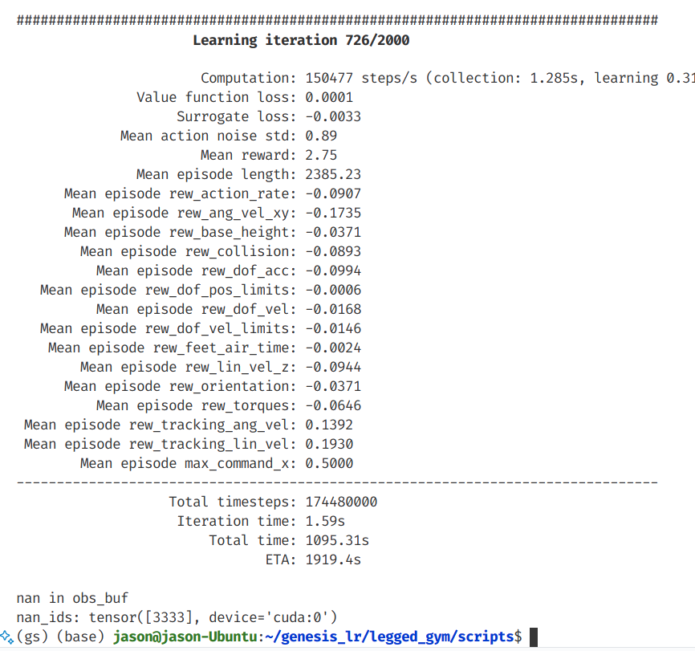
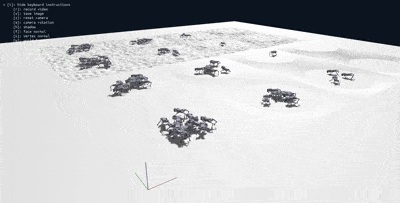

# 🦿 Legged Robotics in Genesis

A [legged_gym](https://github.com/leggedrobotics/legged_gym) based framework for training legged robots in [genesis](https://github.com/Genesis-Embodied-AI/Genesis/tree/main)

## Table of Contents

- [🦿 Legged Robotics in Genesis](#-legged-robotics-in-genesis)
  - [Table of Contents](#table-of-contents)
  - [📅 Updates](#-updates)
  - [🌟 Features](#-features)
  - [🧪 Test Results](#-test-results)
  - [🛠 Installation](#-installation)
  - [👋 Usage](#-usage)
    - [🚀 Quick Start](#-quick-start)
    - [📖 Instructions](#-instructions)
  - [🖼️ Gallery](#️-gallery)
  - [🙏 Acknowledgements](#-acknowledgements)
  - [TODO](#todo)

---
## 📅 Updates

<details>
<summary>2025/03/22</summary>

- I created a [new repo based on legged_gym](https://github.com/lupinjia/legged_gym_ext), containing custom implementation of some RL control papers.

</details>

<details>
<summary>2025/02/23</summary>

- find some bugs in genesis. The environments can return nan values without knowing why (https://github.com/Genesis-Embodied-AI/Genesis/issues/625), which can hinder long-time training where nan values may suddenly come out and terminates your training.

  

</details>

<details>
<summary>2025/02/10</summary>

- add measure_heights support, and provide a demo of exteroceptive locomotion ([go2_rough](https://github.com/lupinjia/genesis_lr/tree/main/legged_gym/envs/go2/go2_rough))


</details>

<details>
<summary>2024/12/28</summary>

- add [wiki page](https://github.com/lupinjia/genesis_lr/wiki) for instructions

</details>

<details>
<summary>2024/12/26</summary>

- add terrain support, optional terrain type: ["plane", "heightfield"]. 

  

- move test results to [tests.md](./test_resources/tests.md)

</details>

<details>
<summary>2024/12/24</summary>

- add a new demo environment `bipedal_walker`

</details>

<details>
<summary>2024/12/23</summary>

- divide main and deploy branches, deploy branch should be used with a custom rsl_rl(which will be open-source soon)

</details>

---


## 🌟 Features

- **Totally based on [legged_gym](https://github.com/leggedrobotics/legged_gym)**
  
  It's easy to use for those who are familiar with legged_gym and rsl_rl

- **Faster and Smaller**
  
  For a go2 walking on the plane task with 4096 envs, the training speed in Genesis is approximately **1.3x** compared to [Isaac Gym](https://developer.nvidia.com/isaac-gym), while the graphics memory usage is roughly **1/2** compared to IsaacGym.

  With this smaller memory usage, it's possible to **run more parallel environments**, which can further improve the training speed.

## 🧪 Test Results

For tests conducted on Genesis, please refer to [tests.md](./test_resources/tests.md)

## 🛠 Installation

1. Create a new python virtual env with python>=3.9
2. Install [PyTorch](https://pytorch.org/)
3. Install Genesis following the instructions in the [Genesis repo](https://github.com/Genesis-Embodied-AI/Genesis)
4. Install rsl_rl and tensorboard
   ```bash
   # Install rsl_rl.
   git clone https://github.com/leggedrobotics/rsl_rl
   cd rsl_rl && git checkout v1.0.2 && pip install -e . --use-pep517

   # Install tensorboard.
   pip install tensorboard
   ```
5. Install genesis_lr
   ```bash
   git clone https://github.com/lupinjia/genesis_lr
   cd genesis_lr
   pip install -e .
   ```

## 👋 Usage

### 🚀 Quick Start

By default, the task is set to `go2`(in `utils/helper.py`), we can run a training session with the following command:

```bash
cd legged_gym/scripts
python train.py --headless # run training without rendering
```

After the training is done, paste the `run_name` under `logs/go2` to `load_run` in `go2_config.py`: 


Then, run `play.py` to visualize the trained model:


### 📖 Instructions

For more detailed instructions, please refer to the [wiki page](https://github.com/lupinjia/genesis_lr/wiki)

## 🖼️ Gallery

| Go2 | Bipedal Walker |
|--- | --- |
|  |  |

## 🙏 Acknowledgements

- [Genesis](https://github.com/Genesis-Embodied-AI/Genesis/tree/main)
- [Genesis-backflip](https://github.com/ziyanx02/Genesis-backflip)
- [legged_gym](https://github.com/leggedrobotics/legged_gym)
- [rsl_rl](https://github.com/leggedrobotics/rsl_rl)
- [unitree_rl_gym](https://github.com/unitreerobotics/unitree_rl_gym)

## TODO

- [x] Add domain randomization
- [x] Verify the trained model on real robots.
- [x] Add Heightfield support
- [x] Add meausre_heights support
- [ ] Add go2 deploy demos and instructions (vanilla and explicit estimator)
- [ ] Add teacher-student implementation