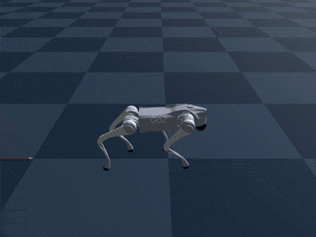
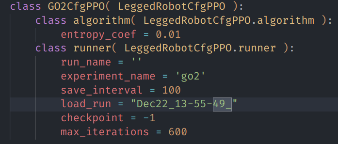

# 🦿 Legged Robotics in Genesis

A [legged_gym](https://github.com/leggedrobotics/legged_gym) based framework for training legged robots in [genesis](https://github.com/Genesis-Embodied-AI/Genesis/tree/main)

## 🌟 Features

- **Totally based on [legged_gym](https://github.com/leggedrobotics/legged_gym)**
  
  It's easy to use for those who are familiar with legged_gym and rsl_rl

- **Faster and Smaller**
  
  For a go2 walking on the plane task with 4096 envs, the training speed is approximately **1.3x** compared to [Isaac Gym](https://developer.nvidia.com/isaac-gym).
  
  - Training speed in genesis: 
  

  - Training speed in isaac gym: 
  
  
  While the graphics memory usage is roughly **1/2** compared to IsaacGym.

  - Graphics memory usage in genesis: 
  

  - Graphics memory usage in isaac gym: 
  

  With this smaller memory usage, it's possible to **run more parallel environments**, which can further improve the training speed.

## 🧪 Test

- Simulation
  
  For a go2 walking on the plane task, training a policy with 10000 envs for 600 ites(which is 144M steps) takes about 12 mins. The play result is as below:
  

- Real Robot
  
  Coming soon

## 🛠 Installation

1. Create a new python virtual env with python>=3.9
2. Install [PyTorch](https://pytorch.org/)
3. Install Genesis following the instructions in the [Genesis repo](https://github.com/Genesis-Embodied-AI/Genesis)
4. Install rsl_rl and tensorboard
   ```bash
   # Install rsl_rl.
   git clone https://github.com/leggedrobotics/rsl_rl
   cd rsl_rl && git checkout v1.0.2 && pip install -e .

   # Install tensorboard.
   pip install tensorboard
   ```
5. Install genesis_lr
   ```bash
   git clone https://github.com/lupinjia/genesis_lr
   cd genesis_lr
   pip install -e .
   ```

## 👋 Usage

### 🚀 Quick Start

By default, the task is set to `go2`(in `utils/helper.py`), we can run a training session with the following command:

```bash
cd legged_gym/scripts
python train.py --headless # run training without rendering
```

After the training is done, paste the `run_name` under `logs/go2` to `load_run` in `go2_config.py`: 



Then, run `play.py` to visualize the trained model:


## Acknowledgements

- [Genesis](https://github.com/Genesis-Embodied-AI/Genesis/tree/main)
- [Genesis-backflip](https://github.com/ziyanx02/Genesis-backflip)
- [legged_gym](https://github.com/leggedrobotics/legged_gym)
- [rsl_rl](https://github.com/leggedrobotics/rsl_rl)
- [unitree_rl_gym](https://github.com/unitreerobotics/unitree_rl_gym)

## TODO

- [x] Add domain randomization
- [ ] Verify the trained model on real robots.
- [ ] Add Heightfield support